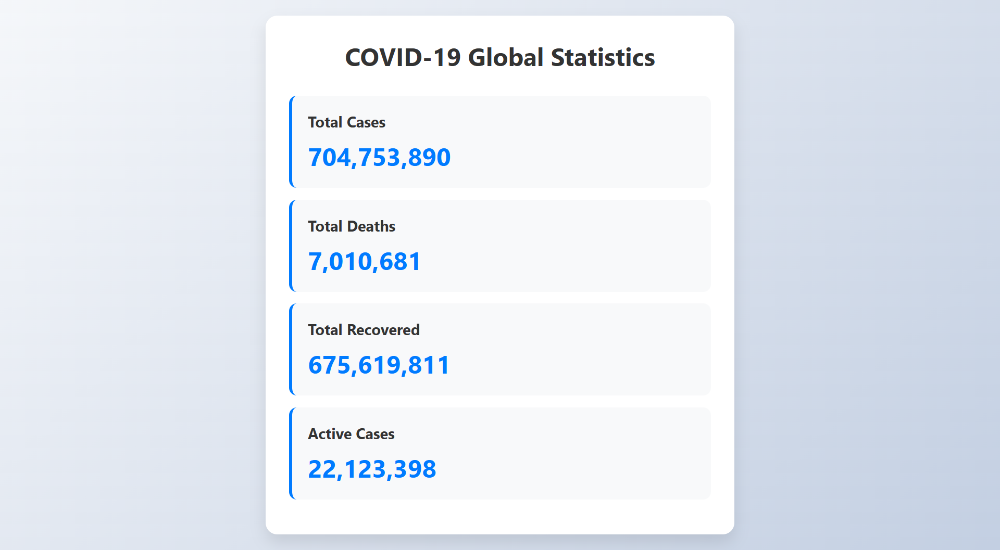

# 🌍 COVID-19 Global Statistics App :

This is a simple yet informative web app built using **HTML**, **CSS**, and **JavaScript** that fetches and displays the latest **COVID-19 global statistics** using a public API.

---

## 🔢 Features :

- Displays **Total Cases**, **Total Deaths**, **Total Recovered**, and **Active Cases** worldwide
- Live and real-time data fetched from API
- Clean and responsive UI
- Built completely using **Vanilla JavaScript** (no frameworks)

---

## 🛠️ Tech Stack :

- HTML5  
- CSS3  
- JavaScript (Fetch API)

---

## 📸 Preview :

